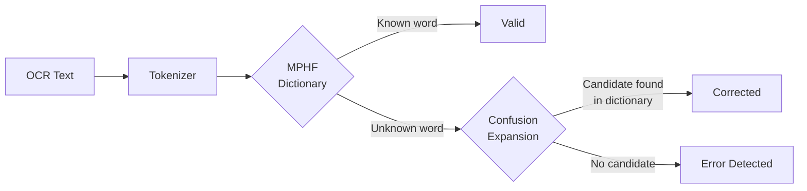
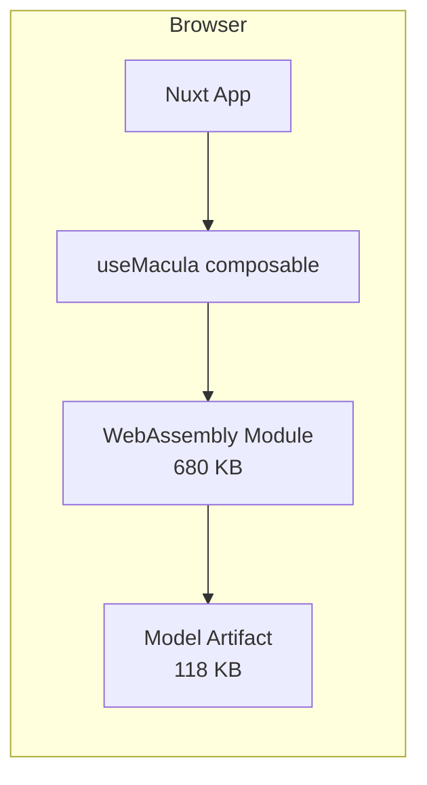
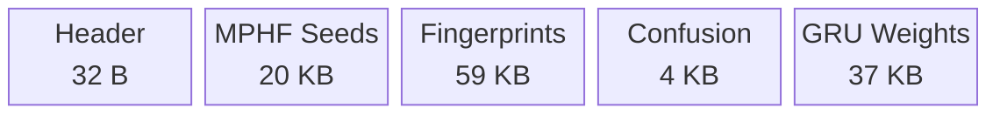

# Macula

**Spot the errors your OCR engine left behind.**

Macula is a lightweight OCR error detection and correction engine built in Zig. It compiles to WebAssembly and runs entirely in the browser with zero server dependency. The full engine plus model weighs in at roughly 800 KB (680 KB WASM + 118 KB model), small enough to auto-load on page open without the user lifting a finger.

The name comes from the *macula* of the human eye, the small region responsible for sharp central vision. That is what this project does for OCR output: it looks closely at each word to catch the mistakes that slipped through.

---

## Why Does This Exist?

OCR engines are good at reading text, but they are not perfect. They confuse characters that look visually similar:

| What OCR reads | What it should be | Why                           |
| -------------- | ----------------- | ----------------------------- |
| `rn`           | `m`               | Looks identical in many fonts |
| `cl`           | `d`               | Joined strokes                |
| `vv`           | `w`               | Two v's merge into w          |
| `0`            | `O`               | Zero vs. letter O             |
| `d0g`          | `dog`             | Mixed digit substitution      |

These errors are invisible to the OCR engine itself but obvious to a human reader. Macula catches them automatically.

---

## How It Works

Macula uses a three-layer detection pipeline. Each layer is fast and operates with zero heap allocation at query time.



### Layer 1: MPHF Dictionary Lookup

Every word is checked against a dictionary using a Minimal Perfect Hash Function (CHD algorithm). This gives O(1) lookup with a 16-bit fingerprint for false-positive rejection (~1 in 65,536 chance of a false match). Known words pass through instantly.

### Layer 2: Confusion Expansion

If a word is not in the dictionary, Macula applies 200 OCR-specific visual confusion rules. For example, it will try replacing `rn` with `m`, or `0` with `O`, and check if the resulting word exists in the dictionary. It supports up to two simultaneous edits (two-edit beam search), which is how it catches `brovvn` as `brown` (two substitutions: `0` to `o` and `vv` to `w`).

### Layer 3: GRU Scoring (Optional)

A character-level GRU language model (int8 quantized, under 40 KB) can score word plausibility. This catches errors that bypass layers 1 and 2. The GRU is optional and currently disabled in the WASM build to keep things lean.

---

## Live Demo

The interactive demo runs entirely in your browser — no server required.
Try it live at: **[https://macula.andka.id](https://macula.andka.id)**

The WASM engine and model auto-load directly from GitHub (~800 KB total payload) on page open.

Paste any OCR output into the text box and hit "Run Detection". You will see each token classified as Valid, Corrected, or Error, with confidence scores and correction suggestions.



---

## Quick Start

### Prerequisites

- [Zig](https://ziglang.org/) 0.16 or later
- Python 3.10+ (for the data pipeline)
- Node.js 18+ (for the demo)

### Build and Test

```bash
# Run all unit tests (53 tests across 9 modules)
zig build test

# Build the WebAssembly module
zig build wasm
```

### Build the Model Artifact

The model artifact (`data/ocr_detector.bin`) is a single binary file that contains the dictionary, confusion rules, and GRU weights. To rebuild it from scratch:

```bash
# 1. Download the ICDAR dataset
kaggle datasets download arjav007/icdar-eng -p data --unzip

# 2. Preprocess: extract words, mine confusion pairs
python scripts/preprocess.py

# 3. Train the GRU language model (requires PyTorch)
python scripts/train_gru.py

# 4. Expand dictionary with a large English word list
python scripts/expand_dict.py

# 5. Compile everything into ocr_detector.bin
python scripts/compile_artifact.py

# 6. Evaluate precision, recall, and F1
python scripts/evaluate.py
```

### Use as a Zig Library

```zig
const ocr = @import("ocr");

// Load the binary artifact
var artifact = try ocr.loader.loadFromFile(allocator, "data/ocr_detector.bin");
defer artifact.deinit();

// Initialize the detector (must be done after the artifact is at its final memory location)
artifact.detector = ocr.OcrDetector.init(
    &artifact.mphf,
    &artifact.confusion_matrix,
    if (artifact.gru != null) &artifact.gru.? else null,
    5.0, // NLL threshold
);

// Process text
var results: [256]ocr.OcrDetector.DetectionResult = undefined;
const text = "Teh quicK brovvn fox";
const n = artifact.detector.processText(text, &results);

for (results[0..n]) |r| {
    switch (r.status) {
        .valid => {},
        .corrected => std.debug.print("{s} -> {s}\n", .{ r.tokenSlice(text), r.correctionSlice().? }),
        .error_detected => std.debug.print("error: {s}\n", .{r.tokenSlice(text)}),
    }
}
```

---

## Project Structure

```
macula/
  build.zig                   Zig build system
  src/
    root.zig                  Public API entry point
    tokenizer.zig             Zero-copy byte tokenizer
    hash.zig                  FNV-1a 64-bit hash + fingerprinting
    mphf.zig                  Minimal Perfect Hash Function (CHD)
    confusion.zig             OCR confusion matrix (200 rules)
    candidate.zig             Confusion candidate generator (two-edit beam)
    gru.zig                   Int8 quantized GRU language model
    detector.zig              Detection pipeline orchestrator
    binary.zig                Binary artifact format spec
    loader.zig                Artifact deserialization
    wasm.zig                  WebAssembly entry point and exports
  demo/                       Nuxt 4 + Tailwind CSS v4 web demo
  scripts/
    preprocess.py             Dataset to wordlist + confusion pairs
    train_gru.py              PyTorch GRU training and int8 export
    expand_dict.py            Merge with large English word list
    compile_artifact.py       Package into ocr_detector.bin
    evaluate.py               Precision/recall/F1 evaluation
  data/
    ocr_detector.bin          ~118 KB compiled model artifact
```

## Binary Artifact Format

All multi-byte values are little-endian. The format is defined in `src/binary.zig`.



| Section           | Size        | Description                                               |
| ----------------- | ----------- | --------------------------------------------------------- |
| Header            | 32 B        | Magic number `OCRD`, version, section counts              |
| MPHF Seeds        | 20 KB       | One u32 seed per bucket for displacement hashing          |
| MPHF Fingerprints | 59 KB       | One u16 fingerprint per slot for false-positive rejection |
| Confusion Pairs   | 4 KB        | 200 mined OCR error patterns with probabilities           |
| GRU Weights       | 37 KB       | 64-hidden-unit int8 quantized language model              |
| **Total**         | **~118 KB** |                                                           |

---

## Design Principles

- **Zero heap allocation at query time.** All scoring uses stack buffers and caller-provided slices. No garbage collection pressure.
- **O(1) dictionary lookup.** The MPHF maps every known word to a unique slot. Lookups are a hash, a table read, and a fingerprint comparison.
- **Tiny footprint.** The entire engine plus model fits in under 800 KB. It loads in milliseconds even on slow connections.
- **Offline compilation.** All expensive work (MPHF construction, GRU training, dictionary merging) happens ahead of time in Python. The runtime is pure lookup.
- **Modular TDD.** Each Zig module contains its own inline tests. Run `zig build test` to exercise all 53 tests across 9 modules.

---

## License

MIT. See [LICENSE](LICENSE) for the full text.

**Data sources:**

- Dataset: [ICDAR English Monograph OCR](https://www.kaggle.com/datasets/arjav007/icdar-eng) (CC-BY-SA-4.0)
- Word list: [dwyl/english-words](https://github.com/dwyl/english-words) (Unlicense)
